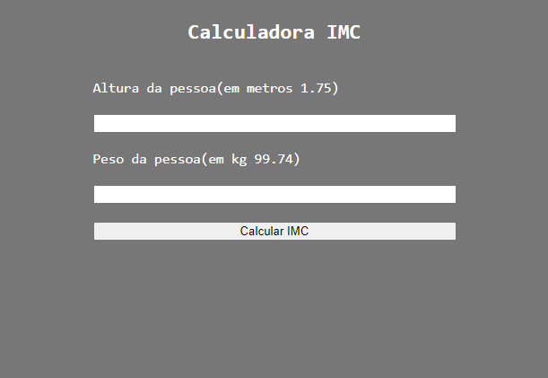
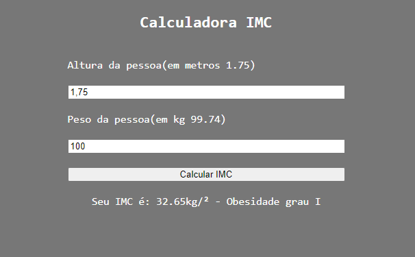

**Um simples projeto para exercitar o jQuery;**
-projeto proposto pela plataforma b7web;

referencia bibliográfica:
*fonte: https://www.mdsaude.com/obesidade/calcule-o-seu-peso-ideal-e-imc/*(apenas para saber as informaçoes de peso e classificação e fórmulas)
___________________________________________________

tecnologias utilizadas:
-HTML;
-CSS;
-JS;
-jQuery.
___________________________________________________

**Imagens do projeto**

**Projeto ainda não finalizado**

